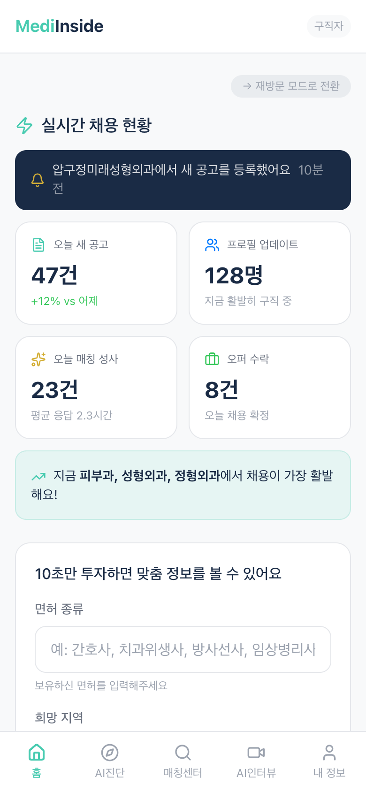
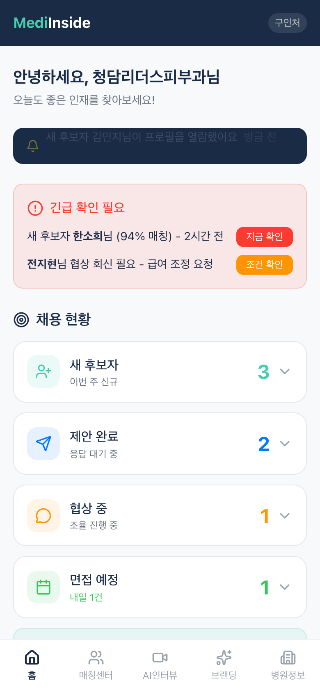
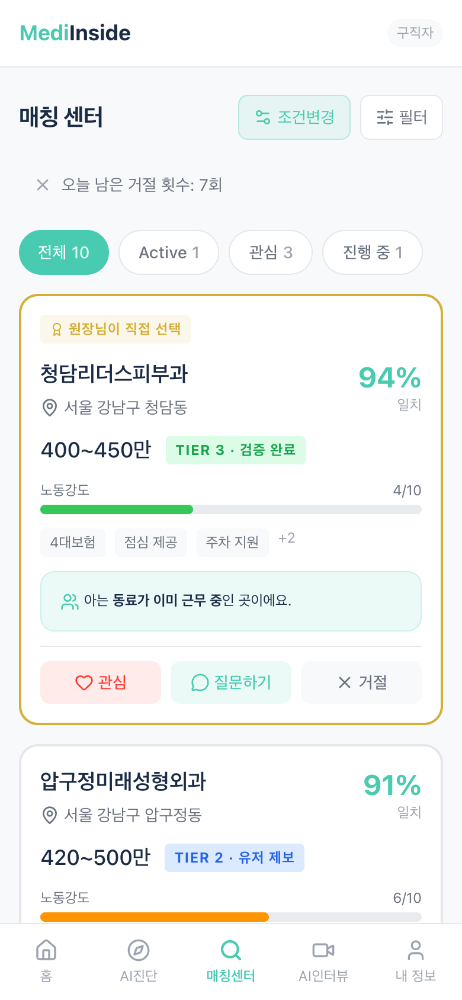
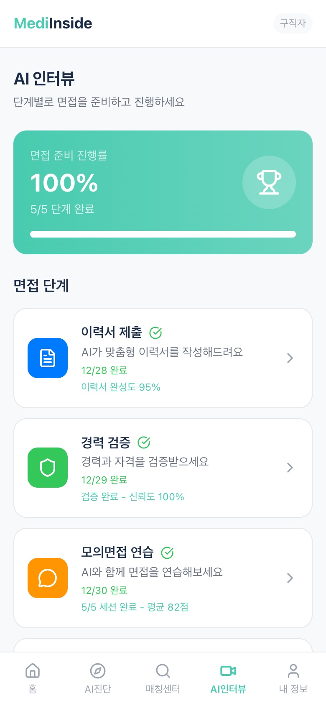

# MediInside

의료 인력 채용 플랫폼 MVP

## 소개

MediInside는 의료 분야 구직자와 구인처를 연결하는 AI 기반 채용 플랫폼입니다. 피부과, 성형외과 등 의료 기관과 간호사, 의료인력 간의 효율적인 매칭을 제공합니다.

## 스크린샷

<p align="center">
  
  
  
  
</p>

| 구직자 홈 | 구인처 홈 | 매칭 센터 | AI 인터뷰 |
|:---:|:---:|:---:|:---:|
| 맞춤 일자리 추천 | 후보자 현황 | 병원 매칭 리스트 | 면접 워크플로우 |

## 주요 기능

### 구직자 (Seeker)
- **AI 인터뷰 워크플로우**: 이력서 제출 → 경력 검증 → 모의면접 → AI 면접 → AI 컨시어지
- **AI 진단 (Fit Test)**: 성향 분석을 통한 맞춤형 직장 추천
- **매칭 센터**: 병원 제안 확인, 관심 표시, 거절 기능
- **시장 리포트**: 의료 채용 시장 동향 분석

### 구인처 (Employer)
- **후보자 관리**: AI 매칭 기반 인재 탐색 및 채용 파이프라인
- **AI 인터뷰**: 면접 코파일럿, 채용공고 작성, 오퍼 발송
- **브랜딩**: 병원 브랜드 진단 및 개선
- **매칭 센터**: 후보자 제안, 조율, 면접 일정 관리

## 기술 스택

- **Framework**: Next.js 16 (App Router)
- **Language**: TypeScript
- **Styling**: Tailwind CSS
- **Animation**: Framer Motion
- **State**: Zustand
- **Icons**: Lucide React
- **Deployment**: Vercel

## 시작하기

```bash
# 의존성 설치
npm install

# 개발 서버 실행
npm run dev

# 빌드
npm run build

# 프로덕션 서버 실행
npm start
```

## 프로젝트 구조

```
src/
├── app/
│   ├── employer/          # 구인처 페이지
│   │   ├── ai-interview/  # AI 인터뷰 (코파일럿, 채용공고 등)
│   │   ├── branding/      # 브랜딩 진단
│   │   ├── candidates/    # 후보자 관리
│   │   ├── matching-center/ # 매칭 센터
│   │   └── ...
│   ├── seeker/            # 구직자 페이지
│   │   ├── ai-interview/  # AI 인터뷰 워크플로우
│   │   ├── fit-test/      # AI 성향 진단
│   │   ├── matching-center/ # 매칭 센터
│   │   └── ...
│   └── globals.css        # 전역 스타일
├── components/
│   ├── layout/            # 레이아웃 컴포넌트
│   └── ui/                # UI 컴포넌트
├── lib/
│   └── mock/              # Mock 데이터
├── stores/                # Zustand 스토어
└── types/                 # TypeScript 타입
```

## 배포

- **Production**: https://mediinside.vercel.app
- **구직자 홈**: https://mediinside.vercel.app/seeker/home
- **구인처 홈**: https://mediinside.vercel.app/employer/home

## 라이선스

Private - All rights reserved
