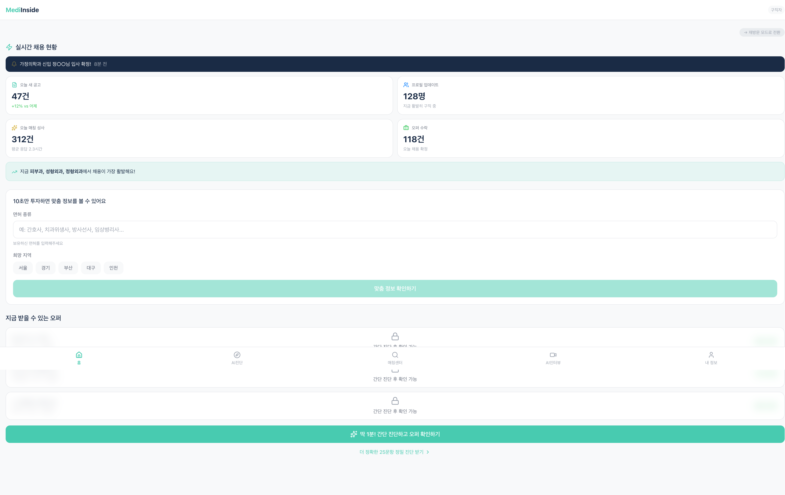
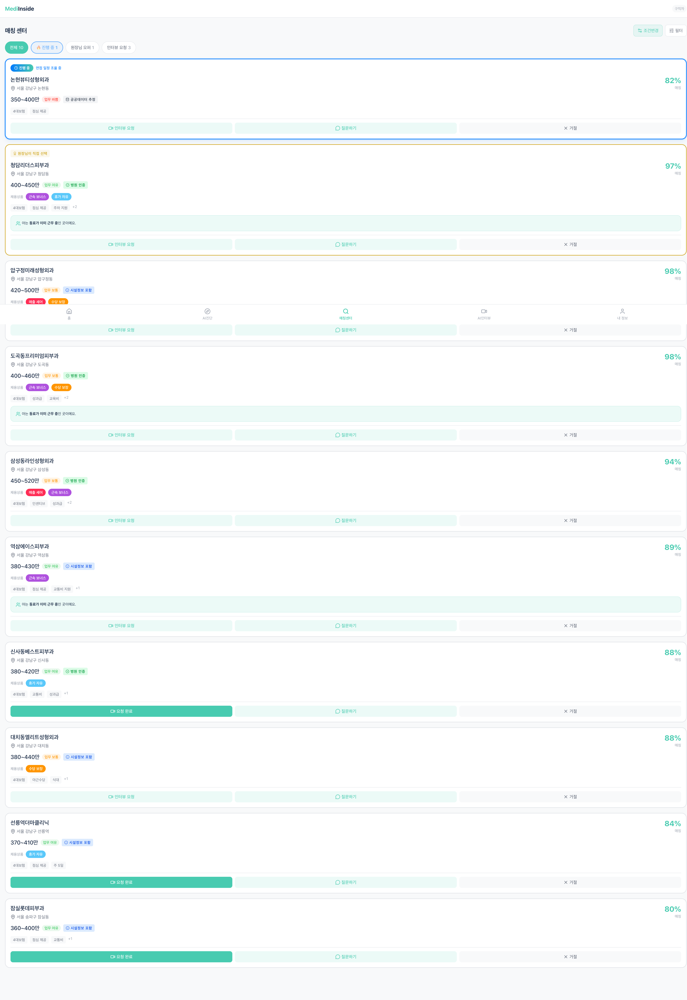
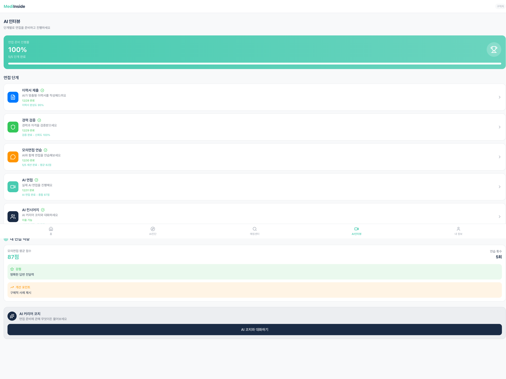
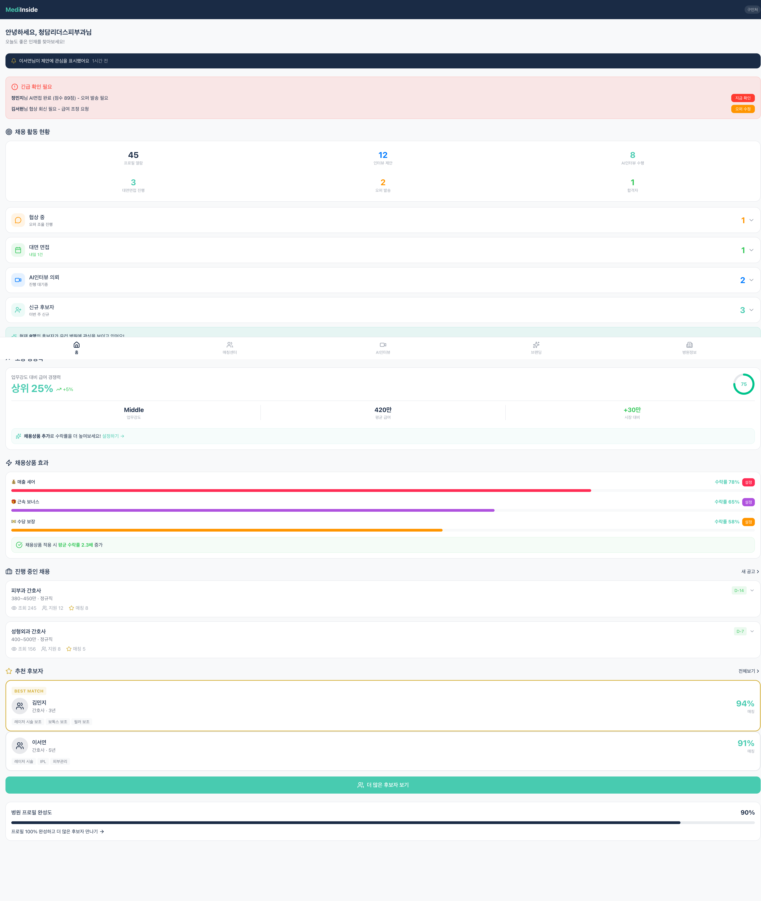
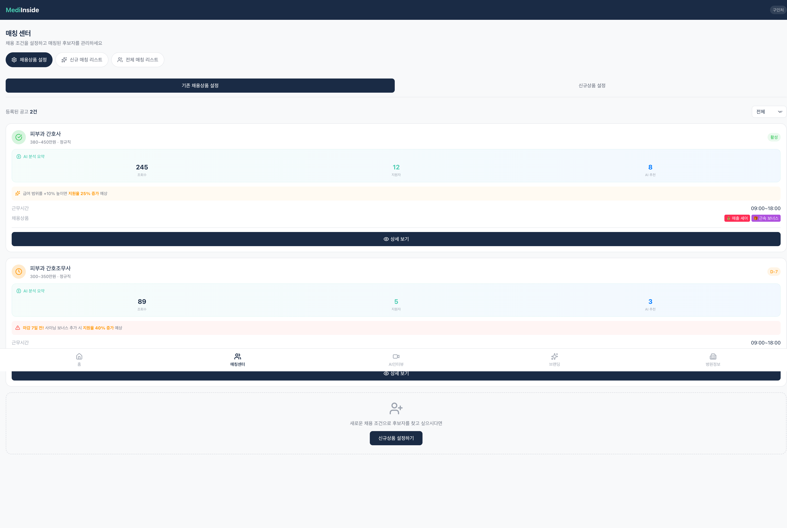

# MediInside v3.2 화면정의서

버전: v3.2 (2026-01-04)
배포 URL: https://mediinside-v3.vercel.app

---

## 1. 구직자 (Seeker)

### 1.1 홈 화면

**경로**: `/seeker/home`

#### 주요 구성요소

| 영역 | 구성요소 | 설명 |
|:---|:---|:---|
| 상단 | 재방문 모드 토글 | 신규/재방문 모드 전환 |
| 실시간 채용 현황 | 알림 배너 | "피부과 3년차 김○○님 채용 확정!" |
| 실시간 채용 현황 | 통계 카드 4개 | 오늘 새 공고, 프로필 업데이트, 오늘 매칭 성사, 오퍼 수락 |
| 10초 진단 | 입력 폼 | 면허 종류, 희망 지역 선택 |
| 오퍼 섹션 | 카드 리스트 | 매칭률과 함께 병원 정보 표시 |
| CTA | 간단 진단 버튼 | `/seeker/quick-fit-test` 이동 |
| CTA | 정밀 진단 버튼 | `/seeker/fit-test` 이동 |

---

### 1.2 매칭 센터

**경로**: `/seeker/matching-center`

#### 주요 구성요소

| 영역 | 구성요소 | 설명 |
|:---|:---|:---|
| 헤더 | 조건변경 버튼 | 희망 조건 수정 |
| 헤더 | 필터 버튼 | 급여, 위치 등 필터링 |
| 탭 필터 | 4개 탭 | 전체(10), 진행 중(1), 원장님 오퍼(1), 인터뷰 요청(3) |
| 카드 | 병원 카드 | 매칭률, 급여, 복리후생, 채용상품 표시 |
| 카드 배지 | 진행 중 | 파란색 배지 + 상태 메시지 |
| 카드 배지 | 원장님이 직접 선택 | 골드 배지 |
| 카드 배지 | 정보 신뢰도 | 공공데이터 추정/병원 인증/시설정보 포함 |
| AI 인사이트 | 동료 정보 | "아는 동료가 이미 근무 중인 곳이에요" |
| CTA 버튼 | 3개 | 인터뷰 요청, 질문하기, 거절 |

#### 거절 시스템 (v3.1+)

- **일일 거절 횟수**: 10회 제한
- **거절 버튼 하단**: 잔여 횟수 표시
- **3회 이하**: 상단 경고 배너
- **0회**: 바이럴루프 팝업 표시

#### 바이럴루프 CTA (v3.2 개선)

| CTA | 설명 | 이동 경로 |
|:---|:---|:---|
| 병원 프로필 완성하기 | 프로필 완성도 모달 바로 표시 | `/employer/profile?showCompletion=true` |
| 친구 초대하기 | 초대 링크 복사 | - |
| 원장님 초대하기 | 초대 링크 발송 | - |
| 재직경험 공유하기 | 리뷰 작성 | `/seeker/profile?section=workExperience` |

---

### 1.3 AI 인터뷰

**경로**: `/seeker/ai-interview`

#### 워크플로우 단계

| 단계 | 경로 | 설명 |
|:---|:---|:---|
| 1. 이력서 제출 | `/seeker/ai-interview/resume` | AI 맞춤형 이력서 작성 |
| 2. 경력 검증 | `/seeker/ai-interview/verification` | 경력/자격 검증 |
| 3. 모의면접 연습 | `/seeker/ai-interview/practice` | AI와 면접 연습 |
| 4. AI 면접 | `/seeker/ai-interview/interview` | 실제 AI 면접 진행 |
| 5. AI 컨시어지 | `/seeker/ai-interview/lounge` | 커리어 코치 상담 |

#### 면접 역량 섹션

- 모의면접 평균 점수
- 연습 횟수
- 강점 / 개선 포인트

---

## 2. 구인처 (Employer)

### 2.1 홈 화면

**경로**: `/employer/home`

#### 주요 구성요소

| 영역 | 구성요소 | 설명 |
|:---|:---|:---|
| 상단 인사 | 병원명 표시 | "안녕하세요, 청담리더스피부과님" |
| 알림 배너 | 실시간 알림 | 프로필 열람, AI면접 완료 등 |
| 긴급 확인 | 액션 카드 | 오퍼 발송, 협상 회신 필요 |
| 채용 활동 현황 | 퍼널 통계 | 프로필 열람 → 인터뷰 제안 → AI인터뷰 → 대면면접 → 오퍼 → 합격 |
| 채용 상태 | 상태 카드 | 협상 중, 대면 면접, AI인터뷰 의뢰, 신규 후보자 |
| 보상 경쟁력 | 경쟁력 카드 | 업무강도 대비 급여 경쟁력 시각화 |
| 채용상품 효과 | 수락률 통계 | 매출 셰어, 근속 보너스, 수당 보장 |
| 진행 중인 채용 | 공고 리스트 | 조회수, 지원자, 매칭 수 표시 |
| 추천 후보자 | 후보자 카드 | 매칭률, 주요 스킬 표시 |
| 프로필 완성도 | 진행바 | 90% 표시, 완성 유도 CTA |

---

### 2.2 매칭 센터

**경로**: `/employer/matching-center`

#### 탭 구조

| 탭 | 설명 |
|:---|:---|
| 채용상품 설정 | 기존/신규 채용 조건 설정 |
| 신규 매칭 리스트 | 새로 매칭된 후보자 리스트 |
| 전체 매칭 리스트 | 모든 후보자 리스트 |

#### 채용상품 설정 탭

- **기존 채용상품 설정**: 등록된 공고 관리
- **신규상품 설정**: 새 채용 조건 생성

#### 공고 카드

| 영역 | 설명 |
|:---|:---|
| 헤더 | 직종, 급여, 고용형태, 상태 (활성/D-7) |
| AI 분석 요약 | 조회수, 지원자, AI 추천 수 |
| AI 인사이트 | "급여 범위를 +10% 높이면 지원율 25% 증가 예상" |
| 상세 정보 | 근무시간, 채용상품 |
| CTA | 상세 보기 → `/employer/jobs/[id]/edit` |

---

### 2.3 병원 프로필

**경로**: `/employer/profile`

#### 프로필 섹션

| 섹션 | 아이콘 | 설명 |
|:---|:---|:---|
| 기본 정보 | Building2 | 병원명, 유형, 규모, 설립연도 |
| 병원 소개 | FileText | 병원 소개 텍스트 |
| 업무환경 | Briefcase | 4단계: 시설→근무→인력→장비 |
| 조직 문화 | Heart | 조직 문화 정보 |
| 복리후생 | Award | 복리후생 목록 |
| 팀 소개 | Users | 팀 구성원 소개 |
| 병원 갤러리 | Image | 병원 사진 |
| 네이버 리뷰 | ExternalLink | 네이버 리뷰 연동 |
| 재직경험 공유 | MessageCircle | 직원 리뷰 / 원장 재직경험 (v3.2+) |

#### 프로필 완성도 (v3.2 개선)

- **완성도 표시**: 90%
- **CTA**: "미완성 항목 확인하고 완성하기"
- **쿼리 파라미터**: `?showCompletion=true`로 접근 시 완성도 모달 자동 표시

#### 재직경험 공유 (v3.2+)

| 서브탭 | 설명 |
|:---|:---|
| 직원 리뷰 | 직원이 작성한 병원 리뷰 |
| 원장 재직경험 | 원장/실장이 작성한 경험담 |

- **리뷰 작성 시 비밀번호 보호**: 공용 채용 계정 환경 대응

---

## 3. 공통 컴포넌트

### 3.1 네비게이션 바

#### 구직자

| 메뉴 | 경로 | 아이콘 |
|:---|:---|:---|
| 홈 | `/seeker/home` | Home |
| AI진단 | `/seeker/fit-test` | Sparkles |
| 매칭센터 | `/seeker/matching-center` | Heart |
| AI인터뷰 | `/seeker/ai-interview` | MessageCircle |
| 내 정보 | `/seeker/profile` | User |

#### 구인처

| 메뉴 | 경로 | 아이콘 |
|:---|:---|:---|
| 홈 | `/employer/home` | Home |
| 매칭센터 | `/employer/matching-center` | Users |
| AI인터뷰 | `/employer/ai-interview` | MessageCircle |
| 브랜딩 | `/employer/branding` | Award |
| 병원정보 | `/employer/profile` | Building2 |

---

## 4. 버전별 주요 변경사항

### v3.2 (2026-01-04)

- 거절횟수 글로벌 상태: `useSyncExternalStore`로 페이지 이동 시에도 유지
- 병원 프로필 완성하기 CTA: 바로 프로필 완성도 모달 표시
- 재직경험 공유: 서브탭 추가 (직원 리뷰 / 원장 재직경험)
- 리뷰 비밀번호 보호 기능

### v3.1 (2026-01-02)

- 거절 횟수 시스템: 10회 제한
- 거절 10회 완료 모달: AI 모의면접 / 매칭 더 받기
- 빈 화면 상태: 24시간 카운트다운
- 진행 중 탭 강조 효과

### v3.0 (2026-01-01)

- 업무환경 4단계: 시설 → 근무 → 인력 → 장비
- 장비 선택 시스템: 13개 진료과별 대표 장비
- 칸반 UI 개선

---

## 5. 기술 스택

| 분류 | 기술 |
|:---|:---|
| Framework | Next.js 16.1.1 (App Router) |
| Language | TypeScript |
| Styling | Tailwind CSS |
| Animation | Framer Motion |
| State | Zustand, useSyncExternalStore |
| Icons | Lucide React |
| Deployment | Vercel |

---

## 관련 문서

- [README](../README.md)
- [변경 이력](./CHANGELOG.md)
- [매칭센터 가이드](./MATCHING_CENTER.md)
